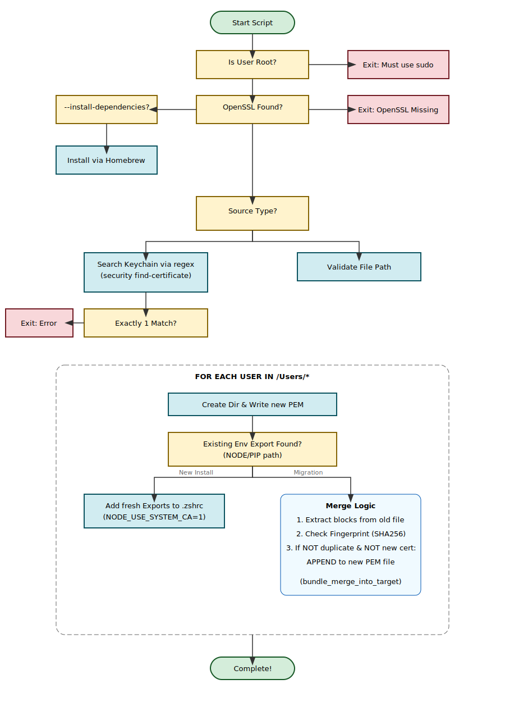

# Certificate installation scripts

Scripts to install a CA certificate, configure Node/npm, Python (pip, uv, Hugging Face Hub, and related TLS clients), Ruby where supported, and clear Docker Hub credentials that can break redirected Docker Hub pulls.

This document describes the certificate installation and validation scripts for **macOS**, **Linux (Debian/Ubuntu)**, and **Windows**.

## Quickstart — which script do I need?

| Your toolchain | Your OS | Go to |
|---|---|---|
| **Maven / Gradle / sbt / Ivy** (JVM) | Linux | [Linux (JVM)](#linux-jvm-install_certs_jvm_linuxsh) |
| **Node / npm or Python (pip / uv / Hugging Face)** | macOS | [macOS](#macos-install_certs_macossh) |
| **Node / npm or Python** | Linux (Debian / Ubuntu) | [Linux (Debian/Ubuntu)](#linux-debianubuntu-install_certs_debian_ubuntush) |
| **Node / npm or Python** | Windows | [Windows](#windows-install_certs_windowsps1) |

Reference: research wiki [Maven Support in package-reroute (DFLOW-136 / DFLOW-116)](https://jfrog-int.atlassian.net/wiki/spaces/RTFACT/pages/2440101931/).

## Script index

| Script | Platform | Purpose |
|--------|----------|---------|
| **install_certs_macos.sh** | macOS | Install cert, set env vars (Node/Python), and clear Docker Hub credentials |
| **validate_install_macos.sh** | macOS | Validate PEM and env config |
| **install_certs_debian_ubuntu.sh** | Debian/Ubuntu | Install cert into system trust + profile.d + user shell rc + Docker cleanup |
| **validate_certs_debian_ubuntu.sh** | Debian/Ubuntu | Validate PEM and env config |
| **install_certs_jvm_linux.sh** | Linux (JVM) | Install CA for Maven/Gradle/sbt/Ivy: RHEL family → `update-ca-trust extract` into system anchors; others → per-host JKS + `JAVA_TOOL_OPTIONS` in `/etc/environment` |
| **validate_certs_jvm_linux.sh** | Linux (JVM) | Validate JVM truststore install (auto-detects Path A vs B; checks anchor file or JKS subject + `/etc/environment` + shell-rc) |
| **_jvm_linux_paths.sh** | Linux (JVM) | Shared constants dot-sourced by installer + validator. Not directly executable. |
| **install_certs_windows.ps1** | Windows | Install cert, set env vars (Node/Python/Ruby), and clear Docker Hub credentials |
| **validate_install_windows.ps1** | Windows | Validate PEM and env config |

Environment variables by platform (see each section for details):

| Variable | Typical use | Notes |
|----------|-------------|--------|
| `NODE_USE_SYSTEM_CA=1` | Node/npm | macOS, Debian, Windows when npm is configured |
| `NODE_EXTRA_CA_CERTS=<path>` | Node/npm | PEM path (bundle allowed) |
| `UV_NATIVE_TLS=true` / `1` | Python **uv** | macOS uses `true`; Windows uses `1`; **not** set by the Debian/Ubuntu script |
| `UV_SYSTEM_CERTS=true` | Python **uv** | Set by macOS for **`python`**, **`huggingface`**, or **`all`** |
| `REQUESTS_CA_BUNDLE=<path>` | Python **requests** / many HTTPS stacks | PEM or bundle path |
| `SSL_CERT_FILE=<path>` | OpenSSL-backed tools, including Ruby | Set on **Debian/Ubuntu** for **`python`**, **`huggingface`**, or **`all`** to the system CA bundle; set on **Windows** for **`python`**, **`huggingface`**, **`ruby`**, or **`all`** to a generated bundle |
| `HF_HUB_DISABLE_XET=1` | Python **huggingface_hub** | Set when **`huggingface` or `all`**: disables XET (not supported with typical MITM / Artifactory redirect flows) |
| `HF_HUB_ETAG_TIMEOUT=86400` | Python **huggingface_hub** | Set when **`huggingface` or `all`**: ETag check timeout (seconds); reduces spurious failures on slow paths |
| `HF_HUB_DOWNLOAD_TIMEOUT=86400` | Python **huggingface_hub** | Set when **`huggingface` or `all`**: download timeout (seconds) |

---

## Docker Hub credential cleanup

Each install script includes a best-effort cleanup for Docker Hub credentials. This fixes environments where corporate egress redirects `registry-1.docker.io` to JFrog Artifactory: locally stored Docker Hub credentials can otherwise be sent to JFrog's token endpoint and produce `Bad Credentials`.

The cleanup attempts `docker logout` for these Docker Hub key forms:

```text
https://index.docker.io/v1/
index.docker.io
docker.io
https://registry-1.docker.io/
registry-1.docker.io
```

If Docker CLI is unavailable, the scripts skip this step. The cleanup is idempotent, logs warnings on logout failures, and never aborts the certificate install.

The cleanup runs in the user context where possible because Docker credentials and credential stores are user-scoped:

- **macOS:** uses `SUDO_USER` when present; under JAMF/root execution, falls back to the console user from `/dev/console` and runs through `launchctl asuser`.
- **Debian/Ubuntu:** uses `SUDO_USER`, then `logname`, then a best-effort active `loginctl` session fallback.
- **Windows:** runs for the current PowerShell user. If the script runs as `SYSTEM`, Docker cleanup is skipped with a warning because the user's Docker credential store is not accessible from that context.

Known limitation: Docker Desktop GUI sign-in can recreate CLI credentials later. If a user signed in through Docker Desktop, sign out in the Docker Desktop UI as well.

---

## macOS: install_certs_macos.sh

### Overview

`install_certs_macos.sh` configures **Node/npm** and/or **Python** on macOS to use a custom CA certificate (e.g. for corporate proxy or package routing). It:

- Runs **only as root** (e.g. `sudo`).
- Either exports a full PEM bundle from macOS system Keychains, or **uses an existing** PEM file you provide.
- For **each user** in `/Users/*`, writes or updates the certificate file and sets environment variables in that user’s `~/.zshrc` so Node and Python use the certificate.
- Clears Docker Hub credentials for the target non-root user, when Docker is installed.

With **Keychain export**, each user gets **package-route.pem** under `~/<extract-path>/`. The bundle includes Apple's system roots and enterprise CAs from `/Library/Keychains/System.keychain`. With **`--use-cert`**, the install uses your PEM path as-is for every user.

### Requirements

- **macOS** (script uses `security` for Keychain export when `--extract-path` is used).
- **Root** (script exits with an error and suggests `sudo` if not root).
- **openssl** on `PATH`. Optional: use `--install-dependencies` to install it via Homebrew in the same run if missing.
- When using **--extract-path**: the **security** (Keychain) tool must be available (system tool; `/usr/bin` is prepended to `PATH` by the script).

---

### How to use

#### Basic usage

```bash
sudo ./install_certs_macos.sh [OPTIONS]
```

#### Options

| Option | Required | Description |
|--------|----------|-------------|
| `--package <npm\|python\|huggingface\|all>` | No (default: **all**) | **npm** (Node only), **python** (Python TLS: uv, requests—no Hugging Face Hub vars), **huggingface** (Python TLS + `HF_HUB_*`), **all** (npm + python + Hugging Face Hub). |
| `--extract-path <path>` | Yes* | Directory **under each user’s home** where **package-route.pem** is written: `~/<path with leading / stripped>/package-route.pem` (e.g. `opt/certs` → `~/opt/certs/...`, `certs` → `~/certs/...`). |
| `--use-cert <path>` | Yes* | Use this existing PEM file instead of exporting from Keychain. Cannot be used with `--extract-path`. |
| `--install-dependencies` | No | If **openssl** is missing, install it via Homebrew and continue in the same run. |
| `-h`, `--help` | — | Print usage and exit. |

\* You must use **either** `--extract-path` **or** `--use-cert`, not both and not neither.

#### Examples

**1. Export Keychain bundle and configure npm + Python for all users**

PEM is written under each user’s home (e.g. `~/opt/certs/package-route.pem` for `--extract-path /opt/certs`) and each user’s `.zshrc` is updated:

```bash
sudo ./install_certs_macos.sh \
  --package all \
  --extract-path /opt/certs
```

**2. Use an existing PEM file (e.g. from IT)**

No Keychain access; same PEM path is set for every user:

```bash
sudo ./install_certs_macos.sh \
  --package all \
  --use-cert /opt/certs/company-ca.pem
```

**3. Only configure Python TLS** (UV_NATIVE_TLS, REQUESTS_CA_BUNDLE; no `HF_HUB_*`)

```bash
sudo ./install_certs_macos.sh \
  --package python \
  --extract-path certs
```

With a relative `--extract-path`, each user gets their own file, e.g. `/Users/jane/certs/package-route.pem`.

**4. Python TLS + Hugging Face Hub** (`huggingface`; same TLS vars plus `HF_HUB_*`)

```bash
sudo ./install_certs_macos.sh \
  --package huggingface \
  --extract-path certs
```

**5. Install openssl if missing, then run (single run)**

```bash
sudo ./install_certs_macos.sh \
  --install-dependencies \
  --package all \
  --extract-path /opt/certs
```

---

### Install validation

**validate_install_macos.sh** checks that the certificate installation succeeded: PEM file(s) exist and are valid (via `openssl x509`). **`--expected-subject` is required** for every invocation. It does **not** require root unless you use `--all-users`.

| Option | Description |
|--------|--------------|
| `--expected-subject <pattern>` | **Required.** At least one cert in each PEM file (bundle) must have a subject matching `<pattern>` (case-insensitive). |
| *(default scope)* | Read `NODE_EXTRA_CA_CERTS` and `REQUESTS_CA_BUNDLE` from the current user’s `~/.zshrc` (with `~` expanded), then validate each referenced PEM file. `UV_NATIVE_TLS` is not validated. |
| `--all-users` | **(Root only.)** For each user in `/Users/*`, read their `~/.zshrc`, resolve cert paths, and validate each PEM. Use: `sudo ./validate_install_macos.sh --expected-subject <pattern> --all-users`. |

**Requirements:** `openssl` on `PATH` (same paths as the install script are prepended).

**Exit code:** 0 if all checks pass, 1 if any check fails.

Use a substring from your CA subject as `<ca-subject-pattern>` (find it with `openssl x509 -in <pem> -noout -subject`).

```bash
# After install: validate current user’s config and cert path(s)
./validate_install_macos.sh --expected-subject "<ca-subject-pattern>"

# Validate every user’s config (run as root)
sudo ./validate_install_macos.sh --expected-subject "<ca-subject-pattern>" --all-users
```

---

### Testing

Tests live in **testing/**. Automated tests cover **macOS**, **Windows**, and **Linux JVM** (not Debian/Ubuntu).

**test_install_certs_macos.sh** runs automated tests for **install_certs_macos.sh** (CLI and argument validation) and **validate_install_macos.sh** (validation with a temp PEM and mock home). No root required for the default test run.

**Requirements:** `openssl` on `PATH` (for generating a temporary cert in tests).

```bash
# From repo root
./testing/test_install_certs_macos.sh

# Or from repo root with testing as current dir
cd testing && ./test_install_certs_macos.sh
```

Exit code 0 if all tests pass, 1 otherwise.

#### Test coverage

| Area | Covered | Not covered |
|------|--------|-------------|
| **install_certs_macos.sh** | **CLI and pre-root:** `--help`; unknown option; invalid `--package`; no cert source; `--use-cert` + `--extract-path` conflict; `--use-cert` with missing file; non-root exit and message. **--use-cert:** valid PEM path and `--package npm`/`python`/`huggingface` (non-root → run as root); invalid PEM content rejected with "Invalid or missing PEM" when run as root (tested when passwordless sudo available). | **Post-root:** PATH/openssl, `--install-dependencies` (Homebrew); Keychain export; per-user loop; Docker credential cleanup; writing PEM and updating `.zshrc`. Requires root and/or Keychain; not run in CI. |
| **validate_install_macos.sh** | **CLI:** unknown option (exit 1); missing `--expected-subject` (exit 1). **Main paths:** default with mock `HOME` and `.zshrc`; missing PEM in `.zshrc` (exit 1); `--all-users` without root (exit 1). Covers `validate_pem`, `get_export_path`, `validate_user_config`. | Multi-cert bundle in `validate_pem`; `--all-users` as root. |

Tests are black-box (exit codes and stderr).

#### Windows tests

**test_install_certs_windows.ps1** runs automated tests for **install_certs_windows.ps1** (CLI and parameter validation; **-UseCert -Package python** sets Python TLS to a generated bundle and leaves existing `HF_HUB_*` unchanged; **-Package ruby** sets `SSL_CERT_FILE`; **-Package huggingface** adds `HF_HUB_*`; **-Package all** sets npm + TLS + Ruby + HF; when run as admin) and **validate_install_windows.ps1** (-ExpectedSubject required, env-based validation: valid PEM, missing file, invalid PEM, subject match and no-match, and system-level env when run as admin). **Run the test script as Administrator** so install script tests and system-level validate tests execute; the script uses a temp directory and an embedded PEM.

**Requirements:** Windows with PowerShell. The install and validate scripts must be in the parent of `testing/` (repo root).

```powershell
# From repo root (PowerShell on Windows, as Administrator)
powershell -NoProfile -ExecutionPolicy Bypass -File testing/test_install_certs_windows.ps1
```

From a non-Windows host you can run the tests on a Windows VM via SSH (e.g. copy the scripts and invoke the same command over `ssh jump-windows`).

Exit code 0 if all tests pass, 1 otherwise. Output shows pass/fail per test and a final count.

| Area | Covered |
|------|--------|
| **install_certs_windows.ps1** | When run as admin: script passes admin check (no "must run as Administrator" error). No cert source (parameter set error); invalid `-Package`; `-CertName` without `-ExtractPath` (and reverse); `-UseCert` and `-CertName` together; `-UseCert` with nonexistent file; `-UseCert` with invalid PEM; `-UseCert` with valid PEM (no "not a file" or "Invalid PEM" error). **Packages:** `-UseCert -Package python` sets TLS-only Machine vars to a generated bundle and does not remove pre-existing `HF_HUB_*`; `-Package ruby` sets `SSL_CERT_FILE` to the generated bundle; `-Package huggingface` adds `HF_HUB_*`; `-Package all` sets npm + TLS + Ruby + HF. |
| **validate_install_windows.ps1** | `-ExpectedSubject` required (exit 1 if missing); current user env (no paths → exit 0); env path to valid PEM (exit 0), missing file (exit 1), invalid PEM (exit 1); subject mismatch (exit 1, FAIL message); system-level (Machine) env when run as admin. Reads `NODE_EXTRA_CA_CERTS`, `REQUESTS_CA_BUNDLE`, and `SSL_CERT_FILE`. |

Tests are black-box (exit codes and stdout/stderr). Paths are passed to the validate script via a temp file when invoking as a child process to avoid command-line parsing issues with backslashes.

---

### Logic in detail

#### 1. Argument handling

- **--package** defaults to `all` if omitted; must be `npm`, `python`, `huggingface`, or `all` (**all** = npm + Python TLS + Hugging Face Hub).
- **Cert source** is one of:
  - **Keychain export:** `--extract-path` set; `--use-cert` must not be set.
  - **Use file:** `--use-cert` set; `--extract-path` must not be set.
- Script exits with an error if:
  - Both `--extract-path` and `--use-cert` are used, or
  - Neither cert source is provided.

#### 2. Root and dependencies

- Script must run as root; otherwise it prints an error and suggests `sudo $0 [options]`.
- Prepends `/usr/bin` and common Homebrew paths to `PATH` so `openssl` and `security` are found.
- If `--install-dependencies` is set and `openssl` is not on `PATH`:
  - Tries Homebrew (`/opt/homebrew/bin/brew` or `/usr/local/bin/brew`).
  - Runs `brew install openssl`, then adds the new `openssl` to `PATH` and **continues** in the same run.
- If `openssl` is still missing after that (or without the flag), script exits with an error.
- If cert source is **Keychain export** (`--extract-path`), script checks that `security` is available; if not, it exits (system tool, cannot be installed).

#### 3. Certificate source

- **--use-cert:** Validates the file with `openssl x509 -noout` and uses it as the certificate for all users. No Keychain access.
- **--extract-path:**
  - Exports all trusted root CAs from `SystemRootCertificates.keychain` and `System.keychain`.
  - Writes the full bundle to each user's `package-route.pem`.

#### 4. Per-user loop

For each directory in `/Users/*` (skipping `Shared` and non-directories):

- **Cert file path:**
  - If **--use-cert:** use that path for every user.
  - If **--extract-path:** use `<homedir>/<extract-path with leading / stripped>/package-route.pem` (e.g. `/opt/certs` → `~/opt/certs/package-route.pem`, `certs` → `~/certs/package-route.pem`). Script creates the directory, writes the PEM, and `chown`s to that user.
- For each user, the script creates `~/.zshrc` if needed, then calls `add_exports_to_file` with that file and the user’s cert path. If `~/.zshrc` is a directory, it skips that user with a warning.

#### 5. Docker Hub credential cleanup

After cert and shell config updates, the script runs Docker Hub credential cleanup as the target non-root user (`SUDO_USER`, or the console user under JAMF). It uses `docker logout` when Docker is available; otherwise it skips the cleanup.

#### 6. add_exports_to_file (per user, per shell file)

For **npm** (if `--package` is `npm` or `all`):

- Ensure `NODE_USE_SYSTEM_CA=1`.
- Add or replace `NODE_EXTRA_CA_CERTS` so it points at the selected cert path.

For **Python TLS** (if `--package` is `python`, `huggingface`, or `all`):

- Ensure `UV_NATIVE_TLS=true` and `UV_SYSTEM_CERTS=true`.
- Add or replace `REQUESTS_CA_BUNDLE` so it points at the selected cert path.

For **Hugging Face Hub** (if `--package` is `huggingface` or `all`):

- Ensure `HF_HUB_DISABLE_XET=1`, `HF_HUB_ETAG_TIMEOUT=86400`, `HF_HUB_DOWNLOAD_TIMEOUT=86400` (same add/replace/leave-as-is behavior via `ensure_export`). With **`python` only**, those lines are **not** added or updated; any existing exports in `.zshrc` are left unchanged (so user or prior-run values are not stripped).

---

#### Flowchart



---

#### Summary (macOS)

- **One run as root** (optionally with `--install-dependencies` to install openssl).
- **One cert source:** either Keychain export (`--extract-path`) or existing file (`--use-cert`).
- **Per user:** PEM at `~/<extract-path>/package-route.pem` for each user (leading `/` on `--extract-path` is stripped); env vars in `~/.zshrc` point to that path. With `--use-cert`, the same PEM path is used for every user.
- **If user already had a different env path:** script replaces it with the selected cert path.
- **Docker:** clears Docker Hub credentials for the target user if Docker is installed.

Users must open a **new terminal** (or `source ~/.zshrc`) for the new environment variables to take effect.

---

## Linux (Debian/Ubuntu): install_certs_debian_ubuntu.sh

### Overview

`install_certs_debian_ubuntu.sh` installs a PEM/CRT into the **Debian/Ubuntu system trust store** (`update-ca-certificates`), writes a managed file under **`/etc/profile.d/package-route-certs.sh`**, and updates the target non-root user’s shell rc (`~/.zshrc` or `~/.bashrc`, depending on their login shell). It **only** supports an existing certificate file (**`--use-cert`**); there is no Keychain or cert-store extraction on Linux in this repo.

- **npm:** `NODE_USE_SYSTEM_CA=1` and `NODE_EXTRA_CA_CERTS` pointing at the **installed** cert under `/usr/local/share/ca-certificates/` (default basename `package-route-custom-ca.crt`, overridable with `--cert-name`).
- **Python TLS:** `REQUESTS_CA_BUNDLE` and `SSL_CERT_FILE` point at the **system** CA bundle (`/etc/ssl/certs/ca-certificates.crt`), which includes your CA after `update-ca-certificates`. **`UV_NATIVE_TLS` is not set** (unlike macOS/Windows Python flows). **`HF_HUB_*`** are set only for **`huggingface` or `all`**; with **`python` only**, existing `HF_HUB_*` lines in the user’s `~/.bashrc` / `~/.zshrc` are not removed.
- **Docker:** best-effort Docker Hub credential cleanup runs for the target non-root user.

### Requirements

- **Debian or Ubuntu** (script checks `/etc/os-release`).
- **Root** (`sudo`).
- **`openssl`** and **`update-ca-certificates`** on `PATH`.
- Optional: **Docker CLI** for Docker Hub credential-store cleanup. If Docker CLI is missing, the cleanup step is skipped.

### Options

| Option | Required | Description |
|--------|----------|-------------|
| `--use-cert <path>` | **Yes** | Path to an existing PEM/CRT file. |
| `--package npm\|python\|huggingface\|all` | No (default: **all**) | What to configure. |
| `--cert-name <name>` | No (default: `package-route-custom-ca`) | Base name for the file installed under `/usr/local/share/ca-certificates/<name>.crt` (not a Keychain/subject pattern). |
| `-h`, `--help` | — | Usage. |

### Examples

```bash
sudo ./install_certs_debian_ubuntu.sh --use-cert /tmp/company-ca.pem
sudo ./install_certs_debian_ubuntu.sh --use-cert /tmp/company-ca.pem --package npm
sudo ./install_certs_debian_ubuntu.sh --use-cert /tmp/company-ca.pem --package huggingface
sudo ./install_certs_debian_ubuntu.sh --use-cert /tmp/company-ca.pem --cert-name my-org-ca
```

### Validation: validate_certs_debian_ubuntu.sh

**`--expected-subject` is required.** Checks PEM paths from the current user’s `~/.bashrc` / `~/.zshrc` and, when present, **`/etc/profile.d/package-route-certs.sh`** (`NODE_EXTRA_CA_CERTS`, `REQUESTS_CA_BUNDLE`, `SSL_CERT_FILE`). With **`--all-users`** (root only), validates `/home/*` users’ rc files.

```bash
./validate_certs_debian_ubuntu.sh --expected-subject "O=Example"
sudo ./validate_certs_debian_ubuntu.sh --all-users --expected-subject "O=Example"
```

---

## Linux (JVM): install_certs_jvm_linux.sh

### Overview

`install_certs_jvm_linux.sh` wires a custom CA certificate into the JVM trust path so Maven, Gradle, sbt, and Apache Ivy traffic redirected through `package-reroute` validates correctly. **JVM trust only** — does not configure Node/npm or Python, and does not touch Docker credentials. Pair with `install_certs_debian_ubuntu.sh` if you need the Node/Python flows or Docker Hub credential cleanup.

The script auto-detects between two lab-verified paths:

- **Path A — `update-ca-trust`** for RHEL/Fedora/CentOS/Amazon-Linux when a JDK whose `lib/security/cacerts` is symlinked to `/etc/pki/ca-trust/extracted/java/cacerts` is on `PATH` (Red Hat OpenJDK, and on some images Corretto). Drops the CA into `/etc/pki/ca-trust/source/anchors/` and runs `update-ca-trust extract`. **No env var is set.**
- **Path B — JKS + `JAVA_TOOL_OPTIONS`** for everything else (Debian/Ubuntu, manual JDK installs that don't symlink to the system store, SDKMAN, snap-confined JDKs). Builds a JKS truststore at `/etc/ssl/package-route-jvm/truststore.jks` containing only the customer CA, then sets `JAVA_TOOL_OPTIONS` in `/etc/environment`. JDK-version-agnostic by construction — one env var serves all current and future JDKs.

Auto-detection logic (`detect_mode` in the script):

1. If `update-ca-trust` is not on `PATH` → **Path B**.
2. If `/etc/pki/ca-trust/extracted/java/cacerts` does not exist → **Path B**.
3. If no `java` is on `PATH` → **Path A** (assumes Red Hat OpenJDK will be installed via `dnf`; the installer prints a loud end-of-run warning instructing the user to re-run with `--mode java-tool-options` if they install Corretto/Temurin/SDKMAN instead).
4. If the resolved `java`'s `lib/security/cacerts` symlinks to the RHEL system store → **Path A**; otherwise **Path B**.

`--mode java-tool-options` or `--mode update-ca-trust` overrides the detection.

Both scripts source a small shared file `_jvm_linux_paths.sh` for the constants block (CA basename default, anchor dir, JKS path, password, env file) so the installer and validator cannot drift.

### Requirements

- **Linux** (Debian/Ubuntu family OR RHEL/Fedora/CentOS/Amazon-Linux family).
- **Root** (`sudo`).
- **`openssl`** on `PATH`.
- **`keytool`** on `PATH` (provided by any JDK) **for Path B**. On Path A the verification step uses `keytool` opportunistically but the install itself does not need it; the installer emits a warning if `keytool` is missing on Path A.

### Options

| Option | Required | Description |
|--------|----------|-------------|
| `--use-cert <path>` | **Yes** | Path to an existing PEM/CRT certificate file. Validated: must be a parseable X.509, not expired, with `CA:TRUE` in basicConstraints. Bundles emit a warning (only the first cert imports). |
| `--mode auto\|java-tool-options\|update-ca-trust` | No (default: **auto**) | Override path detection. |
| `--cert-name <name>` | No (default: `package-route-custom-ca`) | Base name applied to the Path A anchor file (`/etc/pki/ca-trust/source/anchors/<name>.crt`) AND the Path B JKS alias. Must match `[A-Za-z0-9._-]+`. Pass the same value to the validator. |
| `-h`, `--help` | — | Usage. |

### Examples

```bash
# Auto-detect; works on both RHEL family and Debian/Ubuntu
sudo ./install_certs_jvm_linux.sh --use-cert /tmp/ZscalerRoot0.pem

# Force JAVA_TOOL_OPTIONS path even on a RHEL host
sudo ./install_certs_jvm_linux.sh --use-cert /tmp/ZscalerRoot0.pem --mode java-tool-options

# Custom basename for the anchor file / JKS alias
sudo ./install_certs_jvm_linux.sh --use-cert /tmp/ZscalerRoot0.pem --cert-name zscaler-root
```

### Validation: validate_certs_jvm_linux.sh

**`--expected-subject` is required.** The validator auto-detects which path was used (by checking for the JKS file or the anchor file), then asserts the customer CA is present by case-insensitive subject substring match. `--all-users` iterates `/home/*` and is Path B-specific (requires root; checked at `parse_args` time, fails fast). Pass `--cert-name <name>` if the installer was invoked with a non-default value.

```bash
./validate_certs_jvm_linux.sh --expected-subject "O=Zscaler"
sudo ./validate_certs_jvm_linux.sh --expected-subject "O=Zscaler" --all-users
./validate_certs_jvm_linux.sh --expected-subject "O=Zscaler" --cert-name zscaler-root
```

Exit code 0 if all checks pass, 1 otherwise. Missing `JAVA_TOOL_OPTIONS` in a user rc file is a **warning** (not a failure) — `/etc/environment` is the authoritative source for system-wide config. Missing `keytool` while a keystore exists is a **failure** (cannot verify the core invariant).

### Caveats

- **`/etc/environment` activation** (Path B). GUI-launched apps (IntelliJ from the GNOME/KDE launcher) inherit `/etc/environment` via the session manager at login. Existing sessions need a logoff/login to pick up the new env var. The script updates the SUDO_USER's `.bashrc`/`.zshrc` so the *current* shell session has it without re-login.
- **Gradle Daemon caching** (Path B). A Gradle Daemon started before the env var was set still uses its captured environment. Run `gradle --stop` after onboarding.
- **`Picked up JAVA_TOOL_OPTIONS:` banner** (Path B). Every JVM prints this to stderr at startup. CI log parsers that strict-match empty-stderr need to tolerate it.
- **`changeit` truststore password.** The JKS at `/etc/ssl/package-route-jvm/truststore.jks` uses the OpenJDK convention password `changeit`. This is **not** a secret — JKS truststores protect file integrity, not contents, and the trust anchor inside is a public CA certificate. The password is persisted in `/etc/environment` via the `-Djavax.net.ssl.trustStorePassword` flag so unattended JVMs can open the store.
- **Path B truststore extends the JDK's bundled cacerts.** `-Djavax.net.ssl.trustStore=…` in OpenJDK *replaces* the JVM trust source — a JKS containing only the corporate CA would break every public-CA TLS handshake (Maven Central, Gradle plugin portal, Let's Encrypt-fronted mirrors). The installer therefore copies `$JAVA_HOME/lib/security/cacerts` to `/etc/ssl/package-route-jvm/truststore.jks` first, then `keytool -importcert` appends the corporate CA. The resulting store has ~150 public roots **plus** the corporate one. Path A is unaffected — `update-ca-trust extract` already builds the system-wide Java cacerts by merging system anchors with the JDK's defaults.
- **Mixed-distro auto-detection.** On RHEL family with a non-Red-Hat JDK on PATH (Corretto, Temurin, SDKMAN), auto-detection lands on Path B because the JDK's `lib/security/cacerts` is not symlinked to the RHEL system store. On RHEL family with **no** JDK on PATH yet, auto-detection picks Path A on the assumption that Red Hat OpenJDK will follow via `dnf` — the installer emits a loud end-of-run warning naming this assumption.
- **Snap-confined JDKs** are not configured by Path A (read-only squashfs). Auto-detection lands on Path B because the snap cacerts is not symlinked to the system one. Path B works because `JAVA_TOOL_OPTIONS` is read by the JVM at startup regardless of how the JDK was installed.
- **Container-internal JDKs.** Maven/Gradle running inside Docker on a developer machine need the CA wired into the *container* image — host-side install does not propagate. Use a `RUN` step in the Dockerfile or pass `JAVA_TOOL_OPTIONS` via `docker run -e`.
- **`MAVEN_OPTS` clobbering.** If your shell or `~/.mavenrc` sets `MAVEN_OPTS`, those args land AFTER `JAVA_TOOL_OPTIONS` and can override the trust store flags. If `mvn` fails TLS after install, check `env | grep -E '^(JAVA_TOOL_OPTIONS|MAVEN_OPTS)='` — if both are set, ensure `MAVEN_OPTS` does NOT also include `-Djavax.net.ssl.trustStore`.
- **IntelliJ per-IDE SSL store.** `~/.config/JetBrains/<IDE>/ssl/cacerts` is a separate trust store used by the IDE for the plugin marketplace and VCS integration — NOT by Maven/Gradle runs spawned from IntelliJ (those use the JBR's truststore which the env var path covers). If `mvn` works in Terminal but IntelliJ Maven sync fails, add the CA via Settings → Tools → Server Certificates.
- **Idempotent re-runs.** Path B re-creates the JKS each run (single alias guaranteed) and replaces (not appends) the env var line in `/etc/environment`. Path A re-copies the anchor and re-runs `update-ca-trust extract` (with fingerprint-compare to surface a deliberate replacement vs. an idempotent re-run). Running the script twice produces the same final state.
- **Existing anchor file replacement (Path A).** A file at `/etc/pki/ca-trust/source/anchors/<cert-name>.crt` placed by other tooling is replaced if its SHA-256 fingerprint differs from `--use-cert`. The installer prints a `[warn] Replacing existing anchor` line with both fingerprints so the swap is auditable.

### Testing

`./testing/test_install_certs_jvm_linux.sh` runs the Docker smoke matrix across four distro × JDK combinations in parallel from any host with Docker. Each container builds a self-signed lab CA, runs the installer, runs the validator, then exercises negative subject, idempotency, custom `--cert-name`, path-traversal rejection, malformed-PEM rejection, expired-CA rejection, and leaf-cert rejection.

```bash
# From repo root (any host with Docker)
./testing/test_install_certs_jvm_linux.sh
```

Exit code 0 if all containers pass, 1 if any test fails.

The same matrix runs on every push and pull request via `.github/workflows/ci.yml` (`test-linux-jvm` job).

### Summary (Linux JVM)

- **One run as root**, single cert source via `--use-cert`.
- **Path A**: anchor in `/etc/pki/ca-trust/source/anchors/<cert-name>.crt`; `update-ca-trust extract` updates the system Java trust store. No env var.
- **Path B**: JKS at `/etc/ssl/package-route-jvm/truststore.jks` with alias `<cert-name>`; `JAVA_TOOL_OPTIONS` in `/etc/environment` and in the developer user's `.bashrc`/`.zshrc`.
- **Idempotent** (both paths), **re-runnable**, **JDK-version-agnostic** across currently-supported JDKs — JKS format is still read by JDK 8–25 (Path B); Path A piggy-backs on the OS trust store that Red Hat OpenJDK already symlinks. A future JDK that drops JKS support would require a Path B format bump.
- Users must open a new login shell (or `source /etc/environment`) for env changes to take effect. `gradle --stop` to refresh the Gradle Daemon.

---

## Windows: install_certs_windows.ps1

### Overview

`install_certs_windows.ps1` configures **Node/npm**, **Python**, and/or **Ruby** on Windows to use a custom CA certificate. **It must be run as Administrator (or SYSTEM);** the script exits with an error otherwise.

- Either **extracts** a certificate from the Windows cert store (LocalMachine\Root) by **subject substring** (`-CertName`), or **uses an existing** PEM file you provide (**-UseCert**). If **multiple** certs match the pattern, the script logs a warning and picks one (prefers a subject containing `Root`, otherwise the first match).
- With **-CertName** and **-ExtractPath:** writes **package-route.pem** per user under each user’s profile and sets **User**-level env vars in the registry for each user. When Python or Ruby is configured, this file is a combined bundle: the selected cert first, then Windows trusted roots, then valid certs from previously configured bundles (dedupe by SHA-256 fingerprint). **npm:** `NODE_USE_SYSTEM_CA`, `NODE_EXTRA_CA_CERTS`. **Python TLS** (`python`, `huggingface`, or `all`): `UV_NATIVE_TLS`, `REQUESTS_CA_BUNDLE`, `SSL_CERT_FILE`. **Ruby** (`ruby` or `all`): `SSL_CERT_FILE`. **Hugging Face Hub** (`huggingface` or `all`): `HF_HUB_DISABLE_XET`, `HF_HUB_ETAG_TIMEOUT`, `HF_HUB_DOWNLOAD_TIMEOUT`.
- With **-UseCert:** keeps npm pointed at your PEM, and writes a generated combined bundle under `C:\ProgramData\package-reroute\package-route-bundle.pem` for Python/Ruby OpenSSL-style clients. The script sets **Machine**-level env vars and **deletes** overlapping **User**-level vars so they do not override Machine (User wins over Machine on Windows). Which vars are set or cleared depends on `-Package` (see env table above).
- Clears Docker Hub credentials for the current PowerShell user. When running as `SYSTEM`, this cleanup is skipped with a warning because it must run in the user's Windows session.

Re-runs **merge** certs: generated bundles put the custom cert first, append Windows roots, then append valid certs from previous bundles (dedupe by SHA-256 fingerprint). So running with a second cert can preserve existing custom certs instead of replacing them.

### Requirements

- **Windows** with PowerShell.
- **Run as Administrator** (or SYSTEM). The script checks and exits with an error if not elevated.
- When using **-CertName:** at least one certificate in LocalMachine\Root must match; if several match, the script warns and selects one (see Overview).
- Optional: **Docker Desktop / Docker CLI** for Docker Hub credential-store cleanup. If Docker CLI is missing, the cleanup step is skipped.

### How to use

Run from a directory that contains the script (or use full path):

```powershell
powershell -ExecutionPolicy Bypass -File install_certs_windows.ps1 -Package all -CertName "Your Org Root CA" -ExtractPath certs\npm
# Or use an existing PEM:
powershell -ExecutionPolicy Bypass -File install_certs_windows.ps1 -Package all -UseCert C:\path\to\ca.pem
```

| Parameter | Required | Description |
|-----------|----------|-------------|
| `-Package` | No (default: **all**) | `npm`, `python`, `huggingface`, `ruby`, or `all` (all = npm + Python TLS + Ruby + Hugging Face Hub). |
| `-CertName` | Yes* | Substring used to match cert **Subject** in the store (`*CertName*` wildcard). Requires `-ExtractPath`. Cannot be used with `-UseCert`. |
| `-ExtractPath` | Yes* | Directory under each user’s profile for **package-route.pem** (rooted paths are normalized to a folder under the profile, same idea as macOS). Requires `-CertName`. |
| `-UseCert` | Yes* | Path to an existing PEM file. Cannot be used with `-CertName` / `-ExtractPath`. |

\* Use **either** (`-CertName` and `-ExtractPath`) **or** `-UseCert`.

### Examples

**Extract from store and configure all users (run as admin):**

```powershell
.\install_certs_windows.ps1 -Package all -CertName "Your Org Root CA" -ExtractPath certs\npm
```

**Use an existing PEM (Machine-level env; Python/Ruby use a generated combined bundle; User-level cert vars are deleted):**

```powershell
.\install_certs_windows.ps1 -Package all -UseCert C:\Users\Administrator\other-ca\company-ca.pem
```

**Only npm:**

```powershell
.\install_certs_windows.ps1 -Package npm -CertName "Amazon Root CA 1" -ExtractPath certs\npm
```

### Summary (Windows)

- **Admin required.** The script must be run as Administrator (or SYSTEM).
- **Cert source:** either store (`-CertName` + `-ExtractPath`) or file (`-UseCert`).
- **Extract path:** per-user **package-route.pem** and User-level env per `-Package` (npm / Python TLS / Ruby / Hugging Face as above); when Python or Ruby is selected, the file is a combined bundle of the custom cert plus Windows roots. Machine-level cert vars are **cleared** so only User applies (avoids duplication if you previously used -UseCert).
- **UseCert:** npm points at the supplied PEM; Python/Ruby point at the generated combined bundle under `C:\ProgramData\package-reroute\package-route-bundle.pem`; Machine-level env is set per `-Package`; **`python`** does not set `HF_HUB_*` and does **not** clear pre-existing `HF_HUB_*` on the target scope. User-level cert vars are **deleted** so only Machine applies when using `-UseCert` as admin.
- **Docker:** clears Docker Hub credentials for the current PowerShell user. Run the script in the user's session for this step; `SYSTEM` cannot clean up the user's Docker credential store.

Users must start a **new terminal** for env changes to take effect.

---

### Windows: validate_install_windows.ps1

**validate_install_windows.ps1** checks that the certificate installation is valid: PEM file(s) exist and are valid (same validation as the install script). **`-ExpectedSubject` is required** for every invocation. It does **not** require admin unless you use `-AllUsers`.

| Parameter | Description |
|-----------|-------------|
| `-ExpectedSubject <pattern>` | **Required.** At least one cert in each PEM file (bundle) must have a subject matching `<pattern>` (case-insensitive). |
| *(default scope)* | Read `NODE_EXTRA_CA_CERTS`, `REQUESTS_CA_BUNDLE`, and `SSL_CERT_FILE` from the current user's environment (User then Machine), then validate each referenced PEM file. |
| `-AllUsers` | **(Admin only.)** For each user in `C:\Users\*`, read their User registry env, resolve cert paths, and validate each PEM. |

**Exit code:** 0 if all checks passed, 1 if any check failed.

Use a substring from your CA subject as `<ca-subject-pattern>` (find it with `openssl x509 -in <pem> -noout -subject`).

```powershell
# After install: validate current user's env and cert path(s)
.\validate_install_windows.ps1 -ExpectedSubject "<ca-subject-pattern>"

# Validate every user's config (run as Administrator)
.\validate_install_windows.ps1 -ExpectedSubject "<ca-subject-pattern>" -AllUsers
```

---

## Continuous integration

On **push** and **pull request** to `main` or `master`, GitHub Actions runs:

| Job | Runner | Command |
|-----|--------|---------|
| Test (macOS) | `macos-latest` | `sudo ./testing/test_install_certs_macos.sh` |
| Test (Windows) | `windows-latest` | `./testing/test_install_certs_windows.ps1` (PowerShell) |
| Test (Linux JVM) | `ubuntu-latest` | `./testing/test_install_certs_jvm_linux.sh` |

There is no CI job for the Debian/Ubuntu scripts in this workflow.
